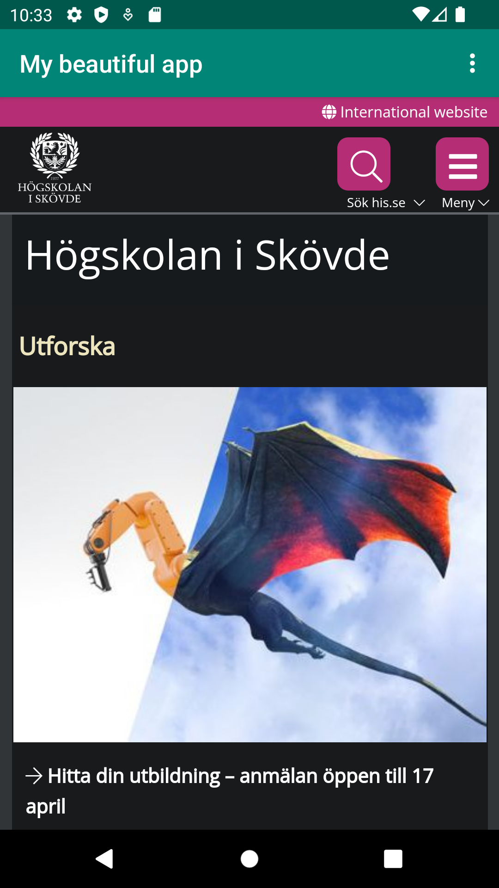
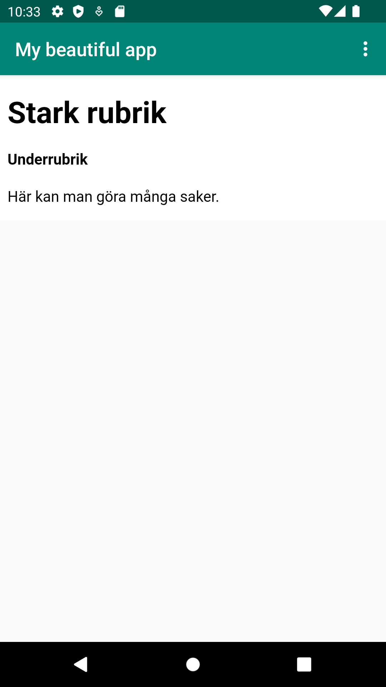

# Rapport

**Skriv din rapport här!**

- Ändrade app_name till 'My beautiful app'.

- Lade till följande kod i MainActivity.java:
private WebView myWebView;
WebViewClient viewClient = new WebViewClient();

myWebView = findViewById(R.id.my_webview); 
myWebView.getSettings().setJavaScriptEnabled(true);
myWebView.getSettings().setAllowFileAccess(true);
myWebView.setWebViewClient(viewClient);

Detta är till för att skapa ett slags fönster som kan visa upp en webbsida.
För att göra det behöver dock appen ha tillgång till internet.
Tillgång till internet ges genom att skriva in följande kod i filen AndroidManifest.xml.
Egentligen behöver appen inte mer än bara tillåtelse till internet för att kunna ansluta sig till en webbsida,
men jag lade även till så att man kan se internetstatusen, se följande kodsnipp:

<uses-permission android:name="android.permission.INTERNET" />
<uses-permission android:name="android.permission.ACCESS_NETWORK_STATE" />

- Lade till länk till his.se som external webpage i MainActivity.java under metoden ’public void showExternalWebPage()’ med hjälp av:
myWebView.loadUrl("https://his.se/");
Nu visar appen his.se när man trycker på external page.
Bild på resultatet av external page:
- 

- Lade till en HTML fil i assets-mappen.
- Länkade till HTML-filen för internal page genom liknande sätt som för external page,
- denna gången refererades filen demo.html i projektets egen assets mapp samt att det blev under metoden public void showInternalWebPage() istället:
myWebView.loadUrl("file:///android_asset/demo.html");
Nu visar appen demo.html som finns i assets i projektet som sin internal page.
- 
- Lade till viss innehåll i HTML filen för att se att filen fungerade.
Bild på resultatet av internal page:
